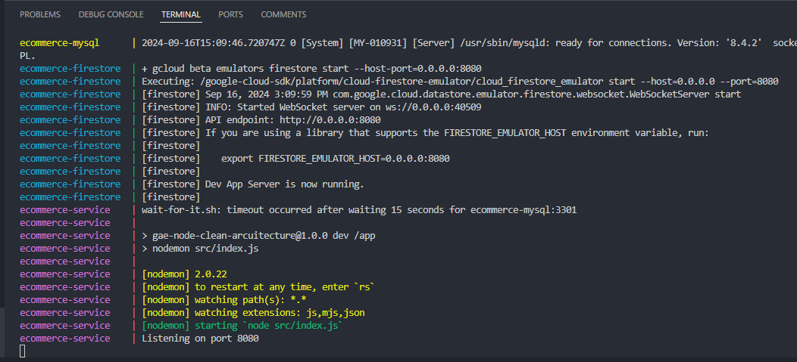
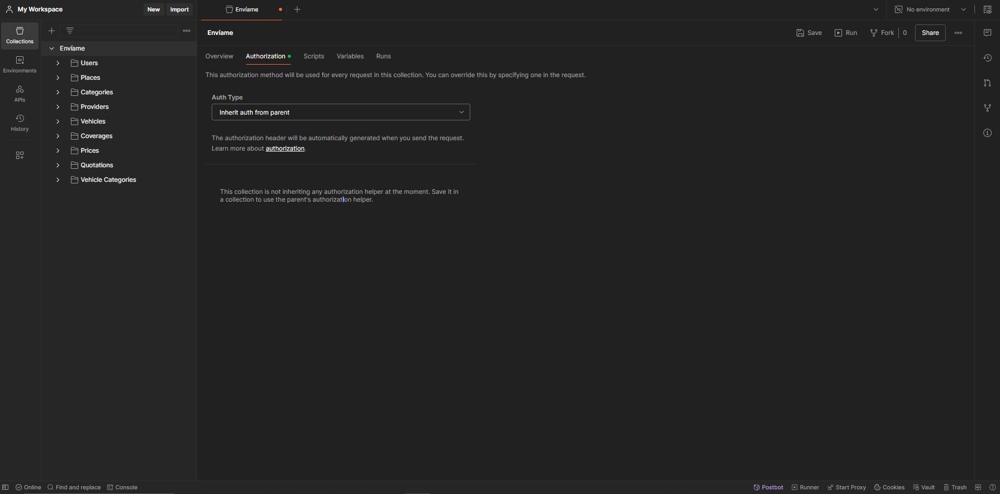
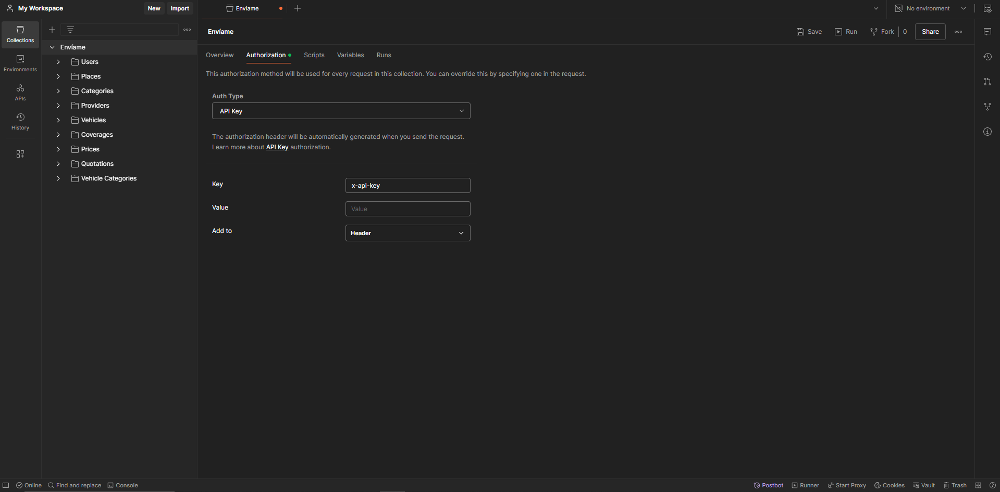

# Backend Test Envíame

Para correr el servicio dockerizado se deben ejecutar el siguiente comando:

```
docker-compose up --build
```

Este comando levantará el servicio y la base de datos, asi mismo se poblará la base de datos con los datos necesarios para hacer pruebas.

Se debe esperar que el servicio levante por completo, para identificar esto, en la terminal debe obtenerse el mensaje `Listening on port 8080` tal como se muestra en la siguiente imagen.


Para realizar las pruebas se comparten 2 Postman collections, `postman_collection_v2.json` exportada como Collection v2 y `postman_collection_v2.json` exportada como Collection v2.1.

## Autenticación
Para proteger el servicio se implementó una protección por API Key, para autenticarse correctamente se deben seguir los siguientes pasos:

- Ubicarse en la colección de postman y dirgirse al apartado de Authorization.
    
- En este apartado, se debe seleccionar como `Auth Type` la opción de API Key, luego se tiene que introducir el valor de `Key` el cual es `x-api-key`, finalmente se agrega el `Value`, que es el API Key, para encontrar esta clave se debe dirigir al archivo `.env` y copiar el valor de la variable`ECOMMERCE_API_KEY.
    

## Consideraciones
- Se realizaron algunas correcciones al archivo `docker-copmose.yml` proporcionado en la plantilla de NodeJS, ya que hubo un problema con el siguiente comando:

    ```
    command: 
        - --default-authentication-plugin=mysql_native_password
    ```

    Debido a este error se elimino este comando y se corrigió añadiendo un enviroment adicional.
    ```
    environment:
        - MYSQL_AUTHENTICATION_PLUGIN=mysql_native_password
    ```
    Adicionalmente se identificó que el servicio inicializaba antes que la base de datos termine de inicializar por completo, debido a esto se añadió un bash script `wait-for-it.sh` ubicado en la ruta `ecommerce-service/Docker/app/wait-for-it.sh`. Este comando valida cada 15 segundos que la base de datos se encuentre inicializada, este script se ejecuta en el `docker-copmose.yml` con el siguiente comando:
    ```
    command: ["./wait-for-it.sh", "${ECOMMERCE_MYSQL_NAME}:3301", "--", "npm", "run", "dev"]
    ```

- Para la capa de persistencia se empleo sequelize con mysql, donde se crearon todas las entidades y relaciones.


